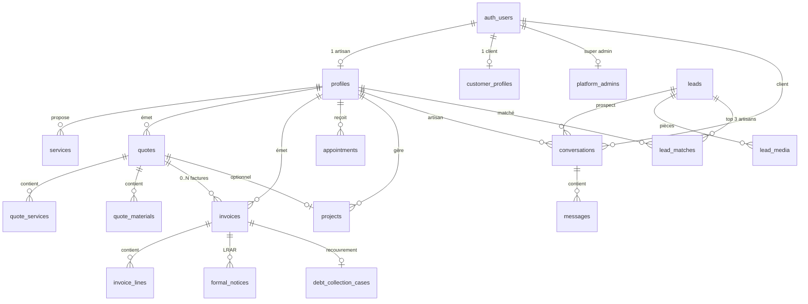

# Schéma base de données

Document de contexte synthétique, dérivé de `supabase/init.sql` et des migrations `01`–`16`.

**Conventions**
- Montants devis/factures : **centimes** (`integer`).
- Bibliothèque d'ouvrages : **euros** (`numeric`).
- Identité : `auth.users` (Supabase Auth) — pas de table `users` dans `public`.
- Pas de table `companies` : l'entité « entreprise artisan » est **`profiles`**.

**Déploiement** : base vierge → `init.sql`, puis migrations `02`–`16` dans l'ordre (certaines étapes se chevauchent volontairement avec `init.sql` pour l'idempotence).

---

## 1. Correspondance conceptuelle

| Concept | Table SQL | Clé |
|---------|-----------|-----|
| **User** | `auth.users` | `id` (uuid) |
| **Company / Artisan** | `profiles` | `user_id` → `auth.users` (1:1) |
| **Customer** | `customer_profiles` | `user_id` → `auth.users` (1:1) |
| **Platform admin** | `platform_admins` | `user_id` (PK) |
| **Service (vitrine)** | `services` | `artisan_id` → `profiles` |
| **Quote** | `quotes` | `artisan_id` → `profiles` |
| **Quote line (prestation)** | `quote_services` | snapshot d'un `service` |
| **Quote line (matériau)** | `quote_materials` | |
| **Invoice** | `invoices` | `quote_id` → `quotes` |
| **InvoiceItem** | `invoice_lines` | `invoice_id` → `invoices` |
| **Conversation** | `conversations` | artisan + client ou lead |
| **Message** | `messages` | `conversation_id` |
| **Lead** | `leads` | token public |
| **Appointment** | `appointments` | vitrine / planning artisan |
| **Project (chantier)** | `projects` | `artisan_id` |
| **Work library item** | `work_items` | par `user_id` artisan |

Un même `auth.users` peut être **artisan** (`profiles`) ou **client** (`customer_profiles`), pas les deux simultanément (routage applicatif).

---

## 2. Types énumérés

| Type | Valeurs |
|------|---------|
| `quote_status` | `draft`, `sent`, `accepted`, `rejected` |
| `appointment_status` | `pending`, `confirmed`, `cancelled` |
| `platform_invitation_status` | `pending`, `accepted`, `cancelled` |
| `platform_account_type` | `client`, `artisan` |
| `lead_source` | `direct`, `artisan_widget` |
| `lead_status` | `new`, `estimated`, `matched`, `submitted`, `converted`, `expired` |
| `lead_media_kind` | `photo`, `video` |
| `invoice_operation_type` | `livraison_biens`, `prestation_services`, `mixte` |
| `vat_collection_nature` | `on_delivery`, `on_payment` |
| `e_invoicing_status` | `DRAFT`, `DEPOSITED`, `RECEIVED_BY_PLATFORM`, `TRANSMITTED`, `APPROVED`, `REJECTED`, `PAID` |
| `invoice_emission_flow` | `e_invoicing`, `e_reporting` |
| `e_reporting_queue_status` | `pending`, `batched`, `submitted`, `failed` |

---

## 3. Vue relationnelle (tables clés)

---

## 4. Tables principales

### `auth.users` (Supabase Auth)

Géré hors schéma `public`. Référencé par `profiles`, `customer_profiles`, `conversations.customer_user_id`, `quotes.customer_user_id`, etc.

---

### `profiles` — Artisan / entreprise

| Colonne | Type | Contraintes |
|---------|------|-------------|
| `id` | uuid | PK |
| `user_id` | uuid | NOT NULL, UNIQUE → `auth.users` CASCADE |
| `business_name` | text | NOT NULL |
| `slug` | text | NOT NULL, UNIQUE, regex `[a-z0-9-]+` |
| `labor_rate_per_hour` | integer | ≥ 0 (centimes/h) |
| `subscription_plan` | text | `base` \| `pro` \| `premium` |
| `subscription_status` | text | `active` \| `past_due` \| `canceled` \| `trialing` |
| `account_status` | text | `active` \| `suspended` |
| `stripe_account_id` | text | UNIQUE (Connect) |
| `stripe_customer_id`, `stripe_subscription_id` | text | index unique partiel |
| Champs légaux | text | SIREN, SIRET, TVA, RCS, adresse, géoloc |
| Champs recouvrement / facturation | divers | retenue défaut 5 %, délais paiement, assurances |

**RLS** : lecture publique (vitrine) ; écriture propriétaire (`user_id = auth.uid()`).

---

### `customer_profiles` — Client

| Colonne | Type | Contraintes |
|---------|------|-------------|
| `id` | uuid | PK |
| `user_id` | uuid | NOT NULL, UNIQUE → `auth.users` CASCADE |
| `display_name` | text | NOT NULL |
| `email`, `phone`, adresses | text | |
| Champs B2B | text | SIREN, SIRET, TVA (facturation électronique) |

**RLS** : accès own (`user_id = auth.uid()`).

---

### `quotes` — Devis

| Colonne | Type | Contraintes |
|---------|------|-------------|
| `id` | uuid | PK |
| `artisan_id` | uuid | NOT NULL → `profiles` CASCADE |
| `customer_user_id` | uuid | → `auth.users` SET NULL |
| `customer_name`, `customer_email` | text | |
| `conversation_id` | uuid | → `conversations` |
| `project_id` | uuid | → `projects` SET NULL |
| `status` | `quote_status` | défaut `draft` |
| `labor_*`, `materials_total`, `grand_total` | integer | centimes HT |
| `signed_at`, `signed_by_name`, `rejected_at` | | signature client |
| `reduced_vat_rate` | numeric | 5.5, 10 ou 20 |
| `generate_vat_attestation` | boolean | |
| `work_site_*` | text | adresse chantier (attestation TVA) |
| `public_token` | text | UNIQUE (accès public **désactivé** mig. 14) |
| `sent_at`, `viewed_at` | timestamptz | |

**RLS** : CRUD artisan ; lecture client si `customer_user_id = auth.uid()`.

---

### `quote_services` — Ligne prestation (snapshot)

| Colonne | Type | Contraintes |
|---------|------|-------------|
| `quote_id` | uuid | → `quotes` CASCADE |
| `service_id` | uuid | → `services` CASCADE |
| `service_title`, `duration_minutes` | | snapshot figé |
| `unit_price`, `line_total` | integer | centimes |
| | | UNIQUE `(quote_id, service_id)` |

---

### `quote_materials` — Ligne matériau

| Colonne | Type | Contraintes |
|---------|------|-------------|
| `quote_id` | uuid | → `quotes` CASCADE |
| `label`, `quantity`, `unit_price`, `line_total` | | `quantity > 0` |
| `supplier_product_id` | uuid | → `supplier_products` |
| `vat_rate` | numeric | défaut 20 |
| `exclude_from_invoice` | boolean | achat direct hors facture |

---

### `invoices` — Facture

| Colonne | Type | Contraintes |
|---------|------|-------------|
| `id` | uuid | PK |
| `artisan_id` | uuid | → `profiles` CASCADE |
| `quote_id` | uuid | → `quotes` RESTRICT |
| `customer_user_id` | uuid | → `auth.users` |
| `invoice_number` | text | |
| `status` | text | `draft` \| `sent` \| `paid` \| `overdue` |
| `invoice_type` | text | `standard` \| `deposit` \| `progress` \| `final` \| `credit_note` |
| `labor_total`, `materials_total`, `grand_total` | integer | centimes HT |
| `parent_invoice_id` | uuid | self-ref |
| `credit_note_for_invoice_id` | uuid | self-ref (avoir) |
| `progress_percentage` | numeric | 0 < x ≤ 100 |
| `retention_rate`, `retention_amount` | | retenue de garantie |
| `retention_released_at` | timestamptz | |
| `quote_reference_total` | integer | snapshot total devis |
| `due_date`, `reminder_count` | | relances impayés |
| `recovery_status` | text | pipeline recouvrement |
| `rubypayeur_case_id` | text | |
| E-facturation | enums/text | `e_invoicing_status`, `emission_flow`, champs PA |

**Contrainte levée (mig. 05)** : plusieurs factures par devis autorisées (acomptes, situations, solde).

**RLS** : artisan all ; client read.

---

### `invoice_lines` — Ligne facture

| Colonne | Type | Contraintes |
|---------|------|-------------|
| `invoice_id` | uuid | → `invoices` CASCADE |
| `line_kind` | text | `labor` \| `service` \| `material` |
| `label`, `quantity`, `unit_price`, `line_total` | | centimes HT |
| `sort_order` | integer | |
| `vat_rate` | numeric | NOT NULL, défaut 20 |
| `vat_category_code` | text | défaut `S` (UN/ECE 5305) |
| `vat_exemption_reason` | text | si TVA 0 |

---

### `conversations` + `messages`

**`conversations`**

| Colonne | Type | Contraintes |
|---------|------|-------------|
| `artisan_id` | uuid | NOT NULL → `profiles` |
| `customer_user_id` | uuid | nullable → `auth.users` |
| `lead_id` | uuid | → `leads` (prospect sans compte) |
| | | CHECK : `customer_user_id IS NOT NULL OR lead_id IS NOT NULL` |
| | | UNIQUE partiel `(artisan_id, customer_user_id)` si client |
| | | UNIQUE partiel `(artisan_id, lead_id)` si lead |

**`messages`**

| Colonne | Type | Contraintes |
|---------|------|-------------|
| `conversation_id` | uuid | → `conversations` CASCADE |
| `sender_user_id` | uuid | nullable si `kind = lead_recap` |
| `kind` | text | `user` \| `lead_recap` |
| `body` | text | non vide |

**`message_attachments`** : bucket/path storage, kind `photo` \| `video` \| `file`.

---

### `leads` — Demandes Soline

| Colonne | Type | Notes |
|---------|------|-------|
| `public_token` | text | UNIQUE, accès anonyme |
| `source` | `lead_source` | direct, widget artisan |
| `origin_artisan_id` | uuid | widget embarqué |
| `status` | `lead_status` | cycle matching |
| `contact_*`, `address_*`, `trade*` | | qualification |
| `estimate_min/max` | integer | fourchette IA |
| `ai_qualification` | jsonb | |
| `claimed_by_user_id` | uuid | conversion en compte client |

**`lead_matches`** : `(lead_id, artisan_id)` UNIQUE, `rank` 1–3, `conversation_id`, brouillon devis IA.

---

## 5. Tables satellites (par domaine)

| Domaine | Tables | Migration |
|---------|--------|-----------|
| **RDV** | `appointments`, `pending_vitrine_appointments`, `services` | init |
| **Invitations** | `platform_invitations` | init |
| **Admin** | `platform_admins`, `admin_audit_logs` | 02 |
| **Bibliothèque ouvrages** | `work_categories`, `work_items` | 04 |
| **Chantiers** | `projects`, `project_time_entries`, `work_orders` | 06 |
| **Devis enrichis** | `quote_photos`, `quote_subcontractors` | 06 |
| **Fournisseurs CRM** | `suppliers` (par artisan) | 06 |
| **Catalogue matériaux global** | `supplier_products` (+ embedding vector) | init |
| **Relances** | `invoice_reminders` | 06 |
| **Stripe SaaS** | `stripe_billing_events` | 07 |
| **Voix** | `artisan_voice_numbers`, `voice_call_logs`, `voice_call_intakes` | init, 01, 08 |
| **Recouvrement** | `formal_notices`, `debt_collection_cases` | 11 |
| **E-facturation** | `e_reporting_queue`, `pa_webhook_events` | init, 09–10 |
| **Notifications** | `conversation_reads`, `user_notification_watermarks`, `push_subscriptions` | 16 |

---

## 6. Contraintes essentielles (résumé)

| Règle | Détail |
|-------|--------|
| Un artisan = un compte | `profiles.user_id` UNIQUE |
| Un client = un compte | `customer_profiles.user_id` UNIQUE |
| Conversation | client **ou** lead, jamais les deux vides |
| Devis signé | RPC `client_accept_quote` : `status = sent` → `accepted` |
| Multi-facturation | Plusieurs `invoices` par `quote_id` (acompte, situation, solde) |
| Avoir | `invoice_type = credit_note`, lien `credit_note_for_invoice_id` |
| Lead matching | Max 3 artisans par lead (`rank` 1–3) |
| Voix | `voice_call_logs.twilio_call_sid` UNIQUE ; quota depuis logs (mig. 12) |
| Recouvrement | 1 `debt_collection_cases` par facture ; 1 `formal_notices` actif par envoi |
| Push | `push_subscriptions.endpoint` UNIQUE |

---

## 7. RLS — principes

| Pattern | Tables |
|---------|--------|
| Lecture publique | `profiles`, `services` (vitrine) |
| Propriétaire artisan | `quotes`, `invoices`, `projects`, `work_items`, … via `profiles.user_id` |
| Propriétaire client | `customer_profiles`, devis/factures liés (`customer_user_id`) |
| Participants | `conversations`, `messages` |
| Service role only | `pending_vitrine_appointments`, `pa_webhook_events`, webhooks |
| Own row | tables notification (16), `stripe_billing_events` (lecture profil) |

Buckets Storage : `lead-media`, `message-documents`, `recovery-documents`.

---

## 8. RPC métier notables

| RPC | Rôle |
|-----|------|
| `client_accept_quote`, `client_reject_quote` | Signature devis côté client |
| `get_notification_counts`, `mark_conversation_read` | Badges & lecture (mig. 16) |
| `match_lead_to_origin_artisan` | Widget sans géoloc (mig. 15) |
| `process_twilio_voice_call_status` | Idempotence quota vocal |
| `quote_by_public_token` | **Neutralisé** (mig. 14) — retourne null |

---

## 9. Index de migrations

| # | Fichier | Apport principal |
|---|---------|------------------|
| 01 | `voice_quota` | Journal `voice_call_logs` |
| 02 | `platform_admin` | Admin, soft-delete profils |
| 03 | `trial_subscription` | Essai Stripe, statuts abo |
| 04 | `work_library` | Ouvrages pré-chiffrés |
| 05 | `btp_invoicing` | Types facture BTP, TVA devis, multi-factures |
| 06 | `retake_gaps` | Chantiers, BI, relances, retenue, overdue |
| 07 | `stripe_billing_events` | Journal webhooks abo |
| 08 | `voice_call_intakes` | Appels IA → brouillon devis |
| 09 | `e_invoicing_invoice` | Enums/champs facturation électronique |
| 10 | `e_reporting_worker` | File e-reporting B2C |
| 11 | `recovery_and_legal_notices` | LRAR + RubyPayeur |
| 12 | `voice_quota_civil_month` | Quota vocal mensuel civil |
| 13 | `message_documents_bucket` | Bucket pièces jointes messages |
| 14 | `disable_public_quote_access` | Désactive devis public |
| 15 | `widget_direct_lead_match` | Matching widget direct |
| 16 | `notification_system` | Badges + push subscriptions |

---

## 10. Fichiers de référence

| Ressource | Chemin |
|-----------|--------|
| Schéma complet | `supabase/init.sql` |
| Migrations incrémentales | `supabase/migration/01` … `16` |
| Règles métier (calculs) | `docs/business-rules.md` |
| Intégrations externes | `docs/integrations.md` |
